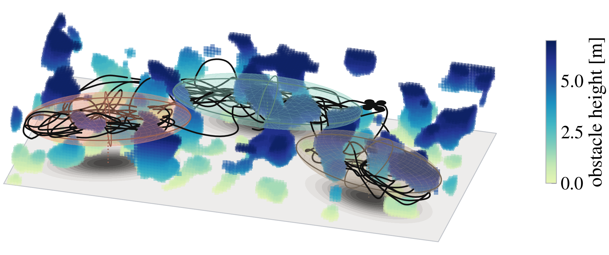
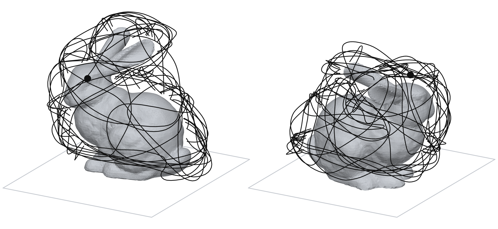
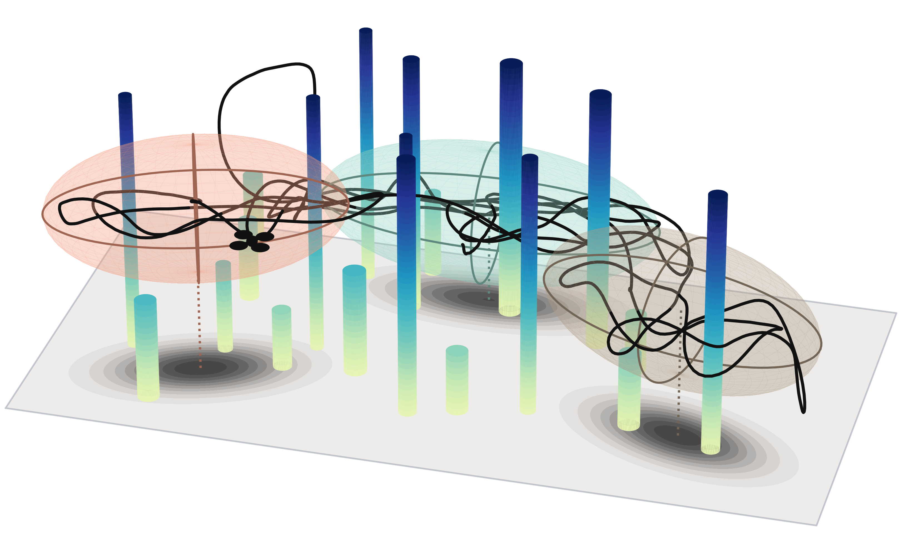
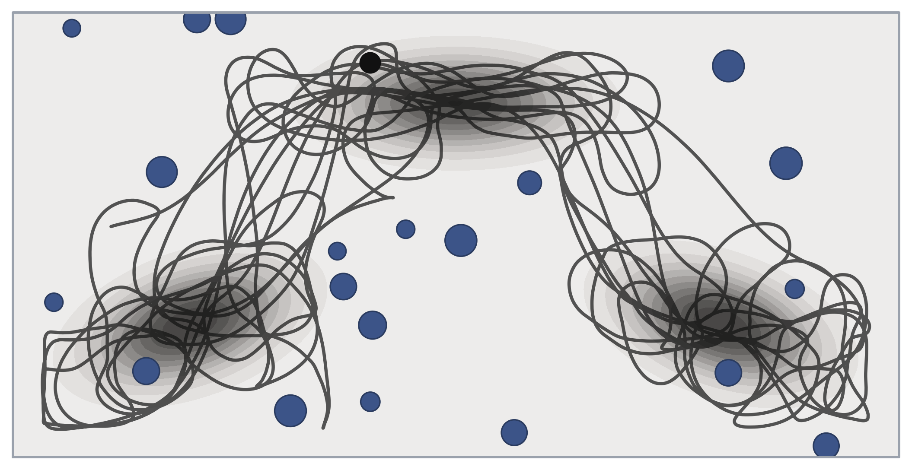

# Ergodic Control MPPI

JAX implementation of service-gated potential-gradient Model Predictive Path Integral
control for single-robot ergodic coverage of a Gaussian-mixture target density.



The same lifted controller flying a Perlin occupancy volume (the SITL map rule:
mockamap `perlin3D` thresholded to 10% of the slab). Bunny-shell, 3D pillar, and
planar deployment snapshots:

| Stanford bunny shell | 3D pillars | Planar deployment |
|---|---|---|
|  |  |  |

## Implementation

At every control step, the controller samples `mppi.K` noisy control sequences
over `mppi.T` steps, integrates the double integrator, and scores obstacle,
map-boundary, MPPI control, and reference-field tracking costs. The weighted
update becomes the next receding-horizon control sequence.

YAML runs are planar. Position dimension `d > 2` is available through
`ergodic_control_mppi.experiments.dimension.lift`; the planar branch stays
bit-identical.

| Path | Responsibility |
|---|---|
| `ergodic_control_mppi/config.py` | One-pass YAML loading and validation |
| `ergodic_control_mppi/parameters.py` | Immutable JAX parameter trees and typed experiment variants |
| `ergodic_control_mppi/models/double_integrator.py` | Batch-compatible dynamics: state `(2d+2,)`, control `(d+1,)` |
| `ergodic_control_mppi/mppi/core.py` | Sampling, rollout costs, reference-field tracking, and MPPI update |
| `ergodic_control_mppi/mppi/field.py` | Analytic GMM score, KDE repulsion, service gating, and scalar potential |
| `ergodic_control_mppi/mppi/single.py` | Single-robot closed-loop scan |
| `ergodic_control_mppi/mppi/replay.py` | Measured-state replay of a recorded flight |
| `ergodic_control_mppi/deploy/` | Occupancy-grid adapters used by ROS 2 and offline UAV maps |
| `ergodic_control_mppi/simulation.py` | Device selection, initialization, dispatch, and NumPy results |
| `ergodic_control_mppi/metrics/` | Ergodicity, discrepancy, modes, and coordination metrics |
| `ergodic_control_mppi/experiments/` | Experiment runners, baselines, analyses, and reports |
| `ergodic_control_mppi/plotting/` | Simulation and publication figures, including `dimension.py` |

`run_simulation(...)` always returns paths with shape `(steps, 1, 6)` (a
trivial robot axis kept for metric/plot compatibility). Internally,
`run_single(...)` uses `(steps, 2d+2)`. Obstacles have shape `(num_obstacles, 3)`
and may be empty; `d >= 3` may append a pillar top height as a fourth column.

## Reference potential field

At every control step, rollout evaluation states are the current position
followed by the first `T - 1` sampled positions. Their temporal increments are
scored with the velocity-residual objective
`sum(-dt * h(z_k) @ delta_z_k + 0.5 * ||delta_z_k||^2)`. The reference velocity
`h(z_k)` is evaluated once on the horizon-wise median of those states and
broadcast across rollouts. Before its speed gauge, the field is the gradient of
the explicit scalar potential in `ergodic_control_mppi/mppi/field.py`: an
analytic target-density score plus KDE repulsion from the fading executed trail
and from the plan itself. Density and recent per-mode service schedule the
tracked speed. The returned surrogate remains the median of all `T` future
sampled positions.

MPPI temperature adapts toward `mppi.ess_target`, and the control-cost
coefficient is recomputed from the current temperature and `mppi.alpha` at
every step.

## Installation

The base installation is CPU-capable and depends on plain `jax`:

```bash
uv sync --python 3.12
```

Optional environments are:

```bash
uv sync --python 3.12 --extra cuda13  # NVIDIA CUDA 13 JAX wheels
```

This follows the official JAX split between plain CPU `jax` and accelerator
extras such as [`jax[cuda13]`](https://docs.jax.dev/en/latest/installation.html).

## Simulation

Run from the repository root:

```bash
uv run python scripts/main.py
uv run python scripts/main.py --config configs/mppi_params.yaml --device cpu --no-plot
```

The CLI accepts `--device auto|cpu|gpu`. `auto` uses a GPU when JAX exposes one
and otherwise falls back to CPU. Controller imports do not query devices,
print, log, or import plotting.

Planar model dimensions are not configuration keys:

- state `(6,)`: `[px, py, vx, vy, yaw, yaw_rate]`
- control `(3,)`: `[ax, ay, angular_acceleration]`

Active MPPI keys are `mppi.T`, `mppi.K`, `mppi.lambda`, `mppi.alpha`,
`mppi.exploration`, `mppi.smooth_window`, `mppi.ess_target`, `mppi.lam_min`,
`mppi.lam_max`, `mppi.memory_length`, and `mppi.noise.sigma`. Reference-field
keys are `reference.weight_track`, `reference.reference_speed`,
`reference.memory_time`, `reference.memory_balance`, `reference.memory_gain`,
`reference.fill_resolution`, `reference.fine_bandwidth`, `reference.plan_gain`,
`reference.transit_speedup`, `reference.dwell_slowdown`,
`reference.service_floor`, `reference.service_time`,
`reference.deficit_ceiling`, and `reference.release_ratio`.

`mppi.memory_length` defaults to `ceil(3 * reference.memory_time /
model.delta_t)`. `reference.fine_bandwidth` defaults to
`2 * reference.fill_resolution ** 2`; either derived value can be overridden
explicitly.

## UAV simulator and ROS 2

[`uav_simulator/`](uav_simulator/) is the vendored SO3 quadrotor, mockamap, and
map-generator stack used for SITL. Origin, license, and local integration notes
are in [`uav_simulator/SOURCE.md`](uav_simulator/SOURCE.md).

The ROS 2 Jazzy package in [`ros2/ergodic_control_mppi_ros/`](ros2/ergodic_control_mppi_ros/)
flies the same JAX controller on that simulator: map adapter, online driver,
independent safety guard, and a recorder that pairs every flight with an ideal
offline run on the identical grid, start state, and seed. Build, topic map,
launch arguments, and safety budget are in
[`ros2/ergodic_control_mppi_ros/README.md`](ros2/ergodic_control_mppi_ros/README.md).

With `DISPLAY` and `XAUTHORITY` exported for the host XWayland session:

```bash
docker compose -f docker/ros2/compose.yaml up --build scene
```

This opens one RViz window with the Perlin map, configured target density,
native SO3 drone, and live trail. Headless:

```bash
docker compose -f docker/ros2/compose.yaml run --rm uav \
    ros2 launch ergodic_control_mppi_ros scene.launch.py rviz:=false
```

The launch accepts `config:=PATH`.

Fixed-altitude UAV smoke run:

```bash
docker compose -f docker/ros2/compose.yaml build uav
docker compose -f docker/ros2/compose.yaml run --rm uav \
    ros2 launch ergodic_control_mppi_ros uav.launch.py \
        config:=/workspace/configs/uav_profile.yaml run_id:=smoke steps:=200 rviz:=false
```

`configs/uav_profile.yaml` is the deployment configuration (`T=150`, `K=250`).
`configs/uav_profile_T150.yaml` is the same frozen profile.
`configs/mppi_params.yaml` is the default offline simulation configuration.

## Research commands

Experiment YAML lives in `configs/experiments/`. Destructive runners refuse to
replace CSV output unless `--overwrite` is supplied.

```bash
uv run python -m ergodic_control_mppi.experiments.literature --config configs/experiments/literature_comparison.yaml --overwrite
uv run python -m ergodic_control_mppi.experiments.baselines --help
uv run python scripts/final_ablation.py --help
uv run python scripts/theory_audit.py --help
uv run python -m ergodic_control_mppi.experiments.dimension {clutter3d,scaling} --help
uv run python scripts/dimension_figure.py --pillars 20 --seed 0
uv run python -m ergodic_control_mppi.experiments.bunny {run,figure} --help
uv run python -m ergodic_control_mppi.experiments.perlin {run,figure} --help
```

The dimension studies fly the deployed profile with its position dimension
lifted and every gain unchanged. `clutter3d` flies a 3D pillar field in which
half the pillars can be flown over, against the same controller held at the
target's mean altitude. `scaling` sweeps workspace dimensions 2, 3, 4 and 6 on
an open box against d-dimensional SMC and HEDAC. Outputs default to
`results/dimension/`. `scripts/dimension_figure.py` renders one stored 3D path.

The bunny comparison flies the same lifted controller around the Stanford bunny
scan (fetched once into `results/bunny/` and pinned by hash) against HEDAC,
FMEC, SMC and SVES transcribed to 3D. The target is a shell 0.75 m off the
scanned surface.

The Perlin demo flies the same lifted controller and the three-altitude target
of `clutter3d` through Perlin noise thresholded to 10% of the slab, as a 0.1 m
voxel grid. `run` scores certificate, contact, and altitude use; `figure`
renders four frames of one stored path. Outputs default to `results/perlin/`.

These runners write an adjacent `.manifest.json` containing resolved inputs,
source hashes, and execution metadata. Resume requires matching provenance;
incompatible outputs require a fresh output path or `--overwrite`.

The frozen T150 bundle lives under `results/uav/T150/`:

```bash
uv run python scripts/run_t150_revision.py plan --bundle results/uav/T150
uv run python scripts/run_t150_revision.py run --bundle results/uav/T150
```

`scripts/report_figures.py` renders paired ablation effects. Timing outputs have
provenance manifests and require `--overwrite` for replacement.

Trial CSV rows preserve the established scalar fields, including
`team_ergodic_error`, `pairwise_overlap`, `safety_metric`,
`redundancy_metric`, `R_pair`, `D_min_pair`, and `runtime_ms`.

## Validation

```bash
uv run python -m compileall ergodic_control_mppi scripts tests
JAX_PLATFORMS=cpu uv run python -m unittest discover -s tests -v
uv lock --check
```

The ROS package has its own tests, which need the container:

```bash
docker compose -f docker/ros2/compose.yaml run --rm uav \
    bash -lc 'cd /ros_ws && colcon test --packages-select ergodic_control_mppi_ros \
              && colcon test-result --verbose'
```
